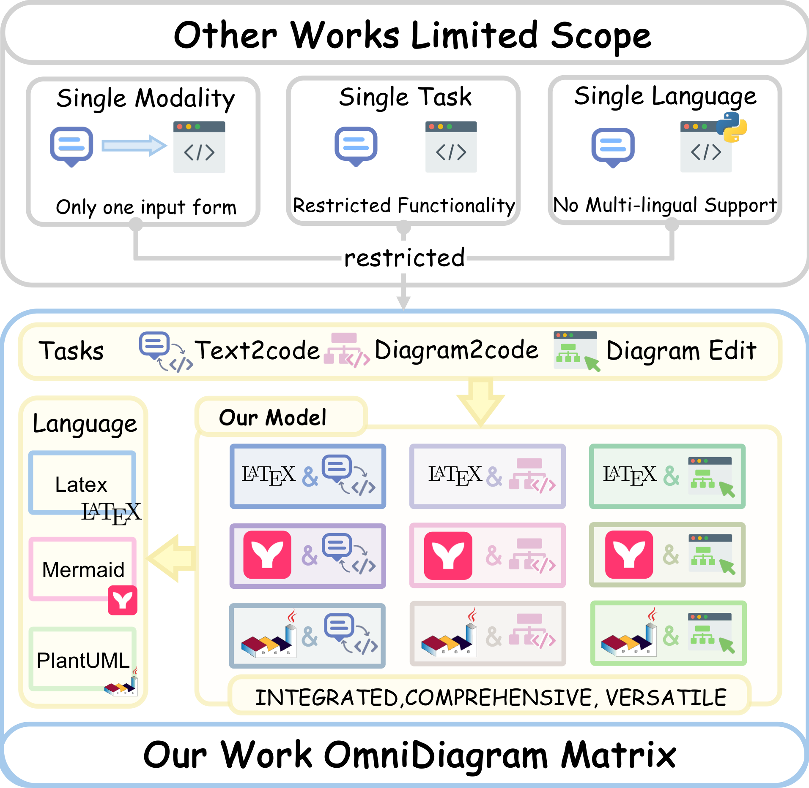
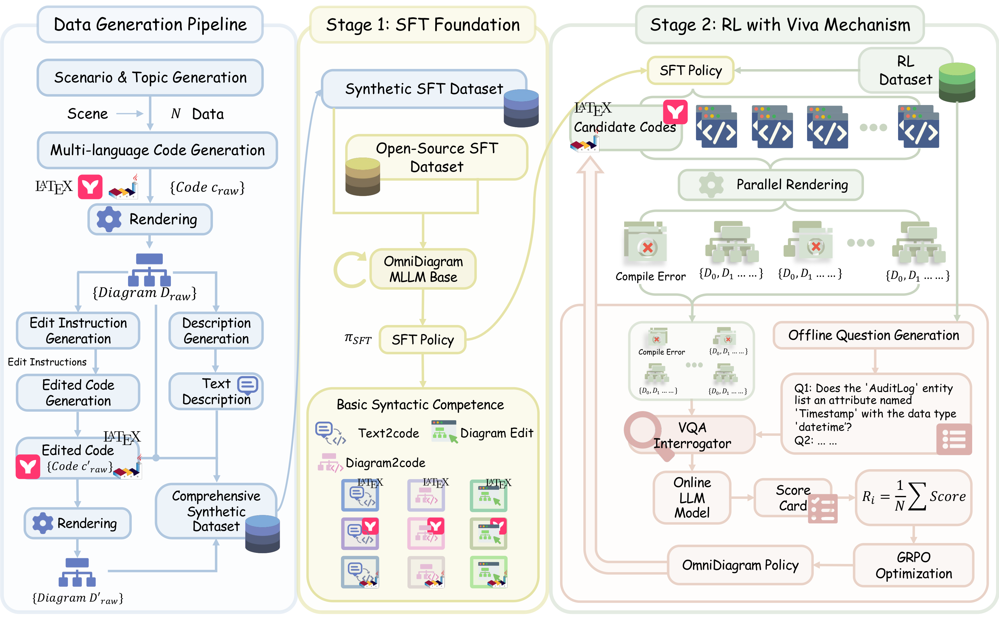

# OmniDiagram: Advancing Unified Diagram Code Generation via Visual Interrogation Reward (ACL 2026 Findings)

[](https://arxiv.org/abs/xxxx.xxxxx) [](https://huggingface.co/Y36521478Y) [](https://huggingface.co/Y36521478Y)

This repository is the official implementation of [OmniDiagram: Advancing Unified Diagram Code Generation via Visual Interrogation Reward](https://arxiv.org/abs/xxxx.xxxxx).

> OmniDiagram: Advancing Unified Diagram Code Generation via Visual Interrogation Reward
>
> Haoyue Yang\*, Xuanle Zhao\*, Xuexin Liu\*, Feibang Jiang, Yao Zhu†
>
> Institute of Automation, Chinese Academy of Sciences; University of Chinese Academy of Sciences; Zhejiang University

## News

**[2026.4.6]** OmniDiagram has been accepted by **ACL 2026 Findings**.

## Overview

The paradigm of programmable diagram generation is evolving rapidly, playing a crucial role in structured visualization. However, most existing studies are confined to a narrow range of task formulations and language support. In this work, we propose **OmniDiagram**, a unified framework that incorporates diverse diagram code languages and task definitions. To address the challenge of aligning code logic with visual fidelity in Reinforcement Learning (RL), we introduce a novel visual feedback strategy named **Visual Interrogation Verifies All (Viva)**. Unlike brittle syntax-based rules or pixel-level matching, Viva rewards the visual structure of rendered diagrams through a generative approach. Furthermore, we construct **M3²Diagram**, the first large-scale diagram code generation dataset, containing over 196k high-quality instances.

### Task Landscape

OmniDiagram unifies three core tasks — **Diagram-to-Code**, **Text-to-Code**, and **Diagram Editing** — across three widely-used diagrammatic languages: **LaTeX (TikZ)**, **Mermaid**, and **PlantUML**, forming a comprehensive 3×3 task-language matrix.

<p align="center">
  
</p>

### Method Pipeline

Our framework follows a three-stage pipeline: (1) **Scalable Data Synthesis** via a top-down, scenario-driven approach to construct the M3²Diagram dataset (196k samples); (2) **Supervised Fine-Tuning (SFT)** on Qwen2.5-VL to establish foundational diagram code generation capacity; (3) **Viva-guided Reinforcement Learning**, where instance-specific visual questions are generated offline, and a reward model evaluates the rendered output of rollout code online, providing fine-grained feedback to iteratively improve visual fidelity.

<p align="center">
  
</p>

## Models

| Model | Size | Download Link |
| ---- | ---- | ---- |
| OmniDiagram-3B (SFT) | 4B | [HuggingFace](https://huggingface.co/Y36521478Y/omnidiagram_3B_sft_2epoch) |
| OmniDiagram-3B (RL) | 4B | [HuggingFace](https://huggingface.co/Y36521478Y/omnidiagram_3B_rl) |
| OmniDiagram-7B (SFT) | 8B | [HuggingFace](https://huggingface.co/Y36521478Y/omnidiagram_7B_sft_2epoch) |
| OmniDiagram-7B (RL) | 8B | [HuggingFace](https://huggingface.co/Y36521478Y/omnidiagram_7B_rl) |

## Data

| Dataset | Download Link |
| ---- | ---- |
| M3²Diagram (SFT) | [HuggingFace](https://huggingface.co/datasets/Y36521478Y/omnidiagram_train_sft) |
| M3²Diagram (RL) | [HuggingFace](https://huggingface.co/datasets/Y36521478Y/omnidiagram_train_rl) |
| M3²Bench (Test) | [HuggingFace](https://huggingface.co/datasets/Y36521478Y/omnidiagram_test) |

## Installation

1. Clone this repo
```bash
git clone https://github.com/Haoyue-Yang/OmniDiagram.git
cd OmniDiagram
```

2. Create environment
```bash
conda create -n omnidiagram python=3.10 -y
conda activate omnidiagram
pip install --upgrade pip
pip install -e .
```

3. Additional packages required for training
```bash
pip install -e ".[train]"
pip install flash-attn --no-build-isolation
```

## Train

The whole training process consists of two stages. The base model `Qwen2.5-VL-3B-Instruct` or `Qwen2.5-VL-7B-Instruct` should be downloaded first.

### SFT Stage

We use [ms-swift](https://github.com/modelscope/ms-swift) for supervised fine-tuning on the M3²Diagram SFT split:
```bash
bash examples/sft.sh
```
Please modify `MODEL_PATH`, `DATASET_PATH`, and `OUTPUT_DIR` in `sft.sh` to your local paths.

### RL Stage (Viva)

We use [EasyR1](https://github.com/hiyouga/EasyR1) for GRPO-based reinforcement learning with the Viva reward mechanism:
```bash
bash examples/grpo_omni.sh
```
Please modify `MODEL_PATH` and `DATA_DIR` in `grpo_omni.sh` to your local paths. The reward function implements the Viva mechanism: it renders the rollout code into images, then uses a VQA model to answer instance-specific visual questions for fine-grained scoring.

### Scripts Structure

```
examples/
├── sft.sh                                # SFT training script (ms-swift)
├── infer.sh                              # Inference script (ms-swift + vLLM)
├── grpo_omni.sh                          # GRPO training launch script (EasyR1)
├── config.yaml                           # RL training configuration
└── reward_function/
    └── omni_rewards/
        ├── entry_point.py                # Reward computation entry point
        ├── scorer_dia2code.py            # Diagram-to-Code scorer (render + VQA)
        ├── scorer_text2code.py           # Text-to-Code scorer (render + VQA)
        ├── scorer_edit.py                # Diagram Editing scorer (render + VQA)
        ├── utils_render.py               # Code rendering (LaTeX / Mermaid / PlantUML)
        └── utils_vqa.py                  # VQA judge API utilities
```

## Inference

We use [ms-swift](https://github.com/modelscope/ms-swift) with vLLM backend for inference:
```bash
bash examples/infer.sh
```
Please modify `MODEL_PATH`, `INPUT_FILE`, and `OUTPUT_FILE` in `infer.sh` to your local paths.

## Results

OmniDiagram consistently surpasses competitive open-source baselines across all tasks on M3²Bench and various external diagrammatic benchmarks. Please refer to our paper for detailed performance.

## Contact

For any questions, you can contact [yanghaoyue2024@ia.ac.cn](mailto:yanghaoyue2024@ia.ac.cn).

## Citation

If you find this work useful, consider giving this repository a star and citing our paper as follows:
```bibtex
@inproceedings{yang2026omnidiagram,
  title={OmniDiagram: Advancing Unified Diagram Code Generation via Visual Interrogation Reward},
  author={Yang, Haoyue and Zhao, Xuanle and Liu, Xuexin and Jiang, Feibang and Zhu, Yao},
  booktitle={Findings of the Association for Computational Linguistics: ACL 2026},
  year={2026}
}
```

## Acknowledgement

The training code is based on [ms-swift](https://github.com/modelscope/ms-swift) and [EasyR1](https://github.com/hiyouga/EasyR1). Thanks for these great works and open sourcing!
